# zkVote: High-Level Architecture Overview

**Document ID:** ZKV-ARCH-2025-002  
**Version:** 1.1  
**Last Updated:** 2025-05-16

## Table of Contents

1. [Introduction](#1-introduction)
2. [Architecture Principles](#2-architecture-principles)
3. [System Overview](#3-system-overview)
4. [Component Architecture](#4-component-architecture)
5. [Data Architecture](#5-data-architecture)
6. [Security Architecture](#6-security-architecture)
7. [Integration Architecture](#7-integration-architecture)
8. [Deployment Architecture](#8-deployment-architecture)
9. [Technology Stack](#9-technology-stack)
10. [Scalability Considerations](#10-scalability-considerations)
11. [Appendices](#11-appendices)

---

## 1. Introduction

### 1.1 Purpose

This document provides a comprehensive overview of the zkVote system architecture. It serves as the authoritative reference for understanding the system's structure, components, and interactions, and guides all development and implementation activities.

### 1.2 Scope

This document encompasses the full zkVote platform including the core cryptographic protocol, integration frameworks, configuration capabilities, and application interfaces. It establishes the technological foundation and design principles underlying the system.

### 1.3 Intended Audience

- Development Team
- System Architects
- Security Engineers
- Integration Partners
- Technical Stakeholders

### 1.4 References

- **zkVote System Requirements Document:** ZKV-SRD-2025-001
- **zkVote Project Overview:** ZKV-EXEC-2025-001
- **zkVote Security Framework:** ZKV-SEC-2025-002
- **zkVote Cross-Chain Integration Guide:** ZKV-INT-2025-003

---

## 2. Architecture Principles

### 2.1 Design Principles

- **Privacy by Design:** Privacy protection is built into every component and interaction.
- **Configurable Trust:** Provides adjustable parameters for governance-specific optimization.
- **Composable Components:** Modular design enables customization across various contexts.
- **Cross-Chain Compatibility:** Multi-chain support is integrated into the core design.
- **Security First:** Security drives all design decisions.
- **Scalable Design:** The architecture is optimized for growth through partitioning and parallelization.
- **Developer Experience:** Clear interfaces and comprehensive documentation facilitate integration.

### 2.2 Architectural Patterns

- **Layered Architecture:** Separation of protocol, integration, configuration, and application layers.
- **Microservices:** Independent deployment of components for flexibility and scalability.
- **Event-Driven Architecture:** Uses events to coordinate asynchronous processes.
- **Domain-Driven Design:** Organizes components around governance and voting concepts.
- **CQRS Pattern:** Separates command operations (voting, delegation) from query operations (result retrieval).
- **Adapter Pattern:** Standardized interfaces for integrating with blockchain networks and governance frameworks.

### 2.3 Hybrid Networking Layer

#### 2.3.1 Network Topology

- **Multi-Tier Architecture:** Separation of consensus, execution, and data layers.
- **Mesh Connectivity:** P2P communication between validator nodes.
- **Hub-and-Spoke:** Centralized services for analytics and monitoring.

#### 2.3.2 Protocol Stack

- **Transport Layer:** TLS 1.3 with Post-Quantum Cipher Suites.
- **Session Layer:** Zero-knowledge authenticated sessions.
- **Application Layer:** REST, GraphQL, and gRPC interfaces.

#### 2.3.3 Decentralized Message Bus

- **Kafka Topics:** Transaction ordering streams with 1M msg/s capacity.
- **Containerized Nodes:** Kubernetes-managed validators with auto-scaling.
- **Network/Compute Separation:** Isolated layers for consensus vs execution.

---

## 3. System Overview

### 3.1 High-Level Architecture

The system is composed of five main layers:

- **Core Protocol Layer:** Implements zero-knowledge cryptographic primitives and the voting protocol.
- **Integration Layer:** Provides adapters for blockchain networks and governance frameworks.
- **Configuration Layer:** Enables customization of protocol parameters and governance rules.
- **Application Layer:** Contains user interfaces and developer tools for interacting with the system.
- **Data Availability Layer:** Manages proof data and voting records across decentralized storage solutions.

### 3.2 System Context

- **Users:** Voters, delegates, and administrators.
- **DAOs & Governance Systems:** Organizations implementing zkVote.
- **Blockchain Networks:** Underlies transaction processing and state persistence.
- **Integration Partners:** External systems integrating with zkVote.
- **Development Tools:** SDKs and APIs to build on top of zkVote.

#### 3.2.1 Cross-Chain Context

- **Layer 1 Networks:** Ethereum, Solana, Polkadot.
- **Layer 2 Solutions:** Arbitrum Nova, Optimism, zkSync.
- **Interoperability Protocols:** CCIP, Hyperlane, IBC.

#### 3.2.2 Trust Model Distribution

- **Coordinator Networks:** Multi-chain validator sets with threshold signatures.
- **Verifier Networks:** Distributed proof verification nodes.
- **Storage Networks:** Decentralized data availability solutions.

#### 3.2.3 Hyperscale DA Integration

- **EigenDA Restaking:** Leverages Ethereum validators for data availability with 1.3MB/s throughput.
- **Celestia 8MB Blocks:** Implements 2D Reed-Solomon encoding with 64x64 share matrix.
- **TeeRollup Hybrid:** Combines TEE execution with DA sampling for 86% cost reduction.

### 3.3 Key Workflows

- **Vote Creation:** Establishing voting parameters and eligibility criteria.
- **Voter Registration:** Cryptographic verification of voter eligibility.
- **Delegation:** Private transfer of voting authority.
- **Vote Casting:** Submission of encrypted votes with zero-knowledge proofs.
- **Vote Tallying:** Aggregation of encrypted votes.
- **Result Verification:** Cryptographic validation of the tallying process.

### 3.4 Cross-Chain Coordination

- **Vote Synchronization:** Ensures consistent state across participating chains.
- **Proof Portability:** Allows verifying proofs generated on one chain on another.
- **Identity Bridging:** Maps identities across disparate blockchain systems.

### 3.5 Inter-Shard Validation

- **Hierarchical Consensus:** Pre-selected node subsets validate cross-shard TXs.
- **Auxiliary Validation:** 5% random TX re-validation through secondary layer.
- **Fitness-Based Sharding:** Dynamic workload distribution using ML models.

---

## 4. Component Architecture

```mermaid
classDiagram
    class CoreProtocolLayer
    class ZeroKnowledgeProofEngine
    class VotingProtocolModule
    class DelegationManagementModule
    class CryptographicCommitmentManager
    class TallyProcessor
    class RecursiveProofArchitecture

    class IntegrationLayer
    class BlockchainAdapters
    class GovernanceFrameworkAdapters
    class IdentityProviderIntegrations
    class CrossChainBridge

    class ConfigurationLayer
    class ParameterManagementModule
    class TrustModelConfigurator
    class PrivacyPolicyEngine

    class ApplicationLayer
    class VoterInterface
    class AdministrativeInterface
    class DeveloperSDK
    class AnalyticsModule

    CoreProtocolLayer <|-- ZeroKnowledgeProofEngine
    CoreProtocolLayer <|-- VotingProtocolModule
    CoreProtocolLayer <|-- DelegationManagementModule
    CoreProtocolLayer <|-- CryptographicCommitmentManager
    CoreProtocolLayer <|-- TallyProcessor
    CoreProtocolLayer <|-- RecursiveProofArchitecture

    IntegrationLayer <|-- BlockchainAdapters
    IntegrationLayer <|-- GovernanceFrameworkAdapters
    IntegrationLayer <|-- IdentityProviderIntegrations
    IntegrationLayer <|-- CrossChainBridge

    ConfigurationLayer <|-- ParameterManagementModule
    ConfigurationLayer <|-- TrustModelConfigurator
    ConfigurationLayer <|-- PrivacyPolicyEngine

    ApplicationLayer <|-- VoterInterface
    ApplicationLayer <|-- AdministrativeInterface
    ApplicationLayer <|-- DeveloperSDK
    ApplicationLayer <|-- AnalyticsModule
```

### 4.1 Core Protocol Components

#### 4.1.1 Zero-Knowledge Proof Engine

- Generates and verifies zero-knowledge proofs for vote eligibility.
- Optimizes proof size and generation time while preserving voter privacy.
- **Circuit Parallelization:** 37% faster proof generation using GPU-optimized Arkworks implementation.
- **Recursive Proof Aggregation:** Enables batch verification of 500+ votes in single transaction.

#### 4.1.2 Recursive Proof Architecture

- **Plonky2 FRI:** Enables 5k TPS recursive proofs with 300ms verification.
- **Artemis CP-SNARK:** Reduces zkML commitment overhead from 11.5x to 1.2x.
- **Monolith Hash:** 37% faster than Poseidon in Merkle tree circuits.

#### 4.1.3 Voting Protocol Module

- Processes vote submissions and enforces voting rules.
- Coordinates the entire voting lifecycle.

#### 4.1.4 Delegation Management Module

- Manages privacy-preserving delegation of voting authority.
- Maintains delegation chains and enforces constraints.

#### 4.1.5 Cryptographic Commitment Manager

- Generates verifiable commitments to voting parameters.
- Maintains commitment trees for efficient verification.
- Provides cryptographic proofs of system integrity.

#### 4.1.6 Tally Processor

- Aggregates encrypted votes and generates result proofs.
- Implements configurable policies for result revelation.

### 4.2 Zero-Knowledge Proof Stack

#### 4.2.1 Modular ZK Proof Systems

| System     | Use Case              | Throughput  | Trust Model   |
| ---------- | --------------------- | ----------- | ------------- |
| zk-SNARK   | Voting proofs         | 1.2k TPS    | Trusted Setup |
| zk-STARK   | Audit trails          | 850 TPS     | Transparent   |
| Risc0 zkVM | Clause execution      | 320 TPS     | WASM-based    |
| Nova       | Recursive aggregation | 5k proofs/s | Folding       |

### 4.3 Integration Layer Components

#### 4.3.1 Blockchain Adapters

- Abstract blockchain-specific interactions.
- Manage transaction submission and confirmation.
- Handle chain-specific cryptographic requirements.

#### 4.3.2 Governance Framework Adapters

- Provide framework-specific interfaces.
- Map governance primitives to zkVote operations.
- Coordinate with external governance processes.

#### 4.3.3 Identity Provider Integrations

- Integrate with token-based eligibility systems.
- Support external identity providers.
- Verify credentials while ensuring privacy.

#### 4.3.4 Cross-Chain Bridge

- Coordinates voting state across blockchain platforms.
- Verifies cross-chain cryptographic proofs.
- Manages voting transactions over multiple chains.

### 4.4 Configuration Layer Components

#### 4.4.1 Parameter Management Module

- Manages voting parameters and enforces constraints.
- Configures cryptographic settings.

#### 4.4.2 Trust Model Configurator

- Configures coordinator roles and authority.
- Manages trust distribution mechanisms and governance constraints.

#### 4.4.3 Privacy Policy Engine

- Implements configurable privacy policies.
- Manages rules for result revelation and enforces privacy constraints.

### 4.5 Application Layer Components

#### 4.5.1 Voter Interface

- Presents voting options and facilitates secure vote submission.
- Displays relevant voting information.

#### 4.5.2 Administrative Interface

- Allows configuration of voting parameters.
- Manages the voting lifecycle and monitors processes.

#### 4.5.3 Developer SDK

- Provides API access for custom integration development.
- Facilitates programmatic interaction and automated voting operations.

#### 4.5.4 Analytics Module

- Aggregates privacy-preserving analytics.
- Generates insights to support governance decision-making.

---

## 5. Data Architecture

### 5.1 Data Model

#### 5.1.1 Key Entities

- **Vote Instance:** Represents a voting event with parameters, eligibility criteria, timing, and status.
- **Voter:** Represents a participant with cryptographic identity, eligibility proofs, and voting power.
- **Delegation:** Represents the transfer of voting authority with related constraints and proofs.
- **Ballot:** Represents an individual encrypted vote submission with verification proofs.
- **Tally:** Represents aggregated voting results with accompanying verification metadata.

#### 5.1.2 Relationships

- A **Vote Instance** has many **Voters**.
- A **Voter** may participate in multiple **Delegations** (inbound/outbound).
- A **Voter** submits one **Ballot** per **Vote Instance**.
- A **Vote Instance** produces one **Tally**.

### 5.2 Data Storage Architecture

- **On-Chain Storage:**  
   Cryptographic commitments, vote parameters, verification proofs, and final tallying results.
- **Off-Chain Storage:**  
   Encrypted votes, intermediate computation states, extended metadata, and historical records.
- **Client-Side Storage:**  
   User preferences, cryptographic keys, and personal voting history.

#### 5.2.1 Three-Tier Storage

| Tier | Storage Medium | Access Time | Cost   | Use Case        |
| ---- | -------------- | ----------- | ------ | --------------- |
| L1   | On-chain       | 2s          | High   | Critical proofs |
| L2   | IPFS Cluster   | 5s          | Medium | Audit logs      |
| L3   | AWS S3 Glacier | 5min        | Low    | Historical data |

### 5.3 MPC-Enhanced Key Management

- **Threshold Signature Schemes:** 2-of-2 parallel signing architecture using CGGMP protocol.
- **Cross-Device Recovery:** Blockchain-anchored backup shares with Google Drive/iCloud integration.
- **Hardware Security Module (HSM) Integration:** AWS CloudHSM/GCP Cloud HSM for enterprise key storage.

### 5.3 Data Flow Diagrams

#### Vote Creation Flow

1. Administrator configures voting parameters.
2. The system generates cryptographic commitments.
3. A vote instance is published on-chain.
4. Eligibility criteria are established.

#### Vote Casting Flow

1. The voter proves eligibility.
2. The system verifies eligibility cryptographically.
3. The voter encrypts the ballot.
4. Zero-knowledge proofs are generated.
5. The encrypted ballot and proofs are submitted.

#### Result Tallying Flow

1. Tallying is triggered.
2. The system aggregates encrypted votes.
3. Cryptographic proofs of correctness are generated.
4. Results are published with verification proofs.

### 5.4 Threshold Signature Infrastructure

#### 5.4.1 Distributed Key Management

- **3-Round FROST:** n-of-m Schnorr signatures with 40% less comms overhead.
- **HSM Orchestration:** AWS CloudHSM integration with TEE-backed signers.
- **Key Rotation:** Quarterly ECDSA rotations with backward-compatible proofs.

---

## 6. Security Architecture

### 6.1 Threat Model

Security measures address:

- External Attackers
- Malicious Participants
- Compromised Coordinators
- Protocol Vulnerabilities
- Implementation Flaws
- Quantum Computing Threats

#### 6.1.1 Stateless Client Support

- **Verkle Tree Migration:** 89% witness size reduction vs Merkle Patricia.
- **Reckle Batch Updates:** O(log n) proof update time for dynamic states.
- **WASM Verifiers:** Browser-native state validation via WASM modules.

### 6.2 Security Controls

#### 6.2.1 Cryptographic Controls

- Implementation of zero-knowledge proofs.
- Threshold encryption for distributed trust.
- Utilization of secure multi-party computation.
- Adoption of post-quantum resistant algorithms.
- Formal verification of cryptographic components.

#### 6.2.2 Access Controls

- Role-based access for management and administrative tasks.
- Cryptographic authentication for all system operations.
- Multi-signature requirements for critical changes.
- Time-locked operations for security-sensitive functions.

#### 6.2.3 Data Protection Controls

- End-to-end encryption and forward secrecy.
- Secure key management practices.
- Adherence to data minimization principles.

### 6.3 Security Architecture Diagram

The diagram illustrates a layered security approach:

- **Perimeter Security:** Defends against external threats.
- **Application Security:** Implements internal controls.
- **Protocol Security:** Ensures cryptographic safeguards.
- **Data Security:** Protects stored and transmitted data.
- **Operational Security:** Secure deployment practices.
- **Post-Quantum Security:** Defends against quantum computing threats.

### 6.4 Enhanced Security Framework

#### 6.4.1 Post-Quantum Cryptographic Foundation

- **Lattice-Based ZK Proofs:** Transition to CRYSTALS-Kyber lattice cryptography.
- **Hybrid Signature Architecture:** Dual ECDSA and SPHINCS+ signature scheme.
- **Quantum-Resistant Key Exchange:** NIST PQC standardized algorithms.

#### 6.4.2 Runtime Security Monitoring

- **eBPF-Based Threat Detection:** Real-time attack surface monitoring with microsecond-level detection.
- **Anomaly Scoring Engine:** ML-driven risk assessment using Proof-of-Stake weighted inputs.
- **Blockchain-Anchored SIEM:** Immutable security event logs with GDPR-compliant redaction.

#### 6.4.3 Confidential Computing Layer

- **TEE-Enabled Vote Processing:** Intel SGX enclaves for privacy-preserving tallying.
- **Secure Cross-Chain Validation:** Oasis Privacy Layer with confidential EVM bridges.
- **Coercion-Resistant Protocols:** Juels-Catalano forced-abstention countermeasures.

---

## 7. Integration Architecture

### 7.1 API Architecture

The system exposes its functionality through multiple APIs:

- **Core Protocol API:** Low-level cryptographic operations.
- **Governance API:** Voting and administration operations.
- **Integration API:** Framework-specific adapters.
- **Developer API:** High-level operations for application development.

### 7.2 Integration Patterns

- **Direct Integration:**  
   Uses libraries, SDK components, and WebAssembly modules.
- **Service-Based Integration:**  
   Provides RESTful APIs, GraphQL endpoints, and WebSocket interfaces.
- **Blockchain Integration:**  
   Employs smart contract interfaces, event listeners, and transaction submission mechanisms.

### 7.3 Integration Reference Architecture

### 7.3.1 Interface Standardization

- **EIP-7105 Compliance:** Implements standard governance event hooks and parameter encoding.
- **ERC-1202 Compatibility Layer:** Backwards compatibility with legacy voting systems.

### 7.4 Cross-Chain Privacy Gateway

- **Confidential EVM Bridge:** Sapphire runtime for encrypted contract execution.
- **Gas Token Normalization:** Native token payment across chains via Celer IM.
- **Selective Disclosure:** Three-tiered privacy (public/encrypted/fully private).

### 7.5 Universal Messaging Layer

| Protocol  | Throughput | Security Model          | Use Case         |
| --------- | ---------- | ----------------------- | ---------------- |
| CCIP      | 1.2k TPS   | Risk Management Network | Token Transfers  |
| Hyperlane | 850 TPS    | Economic Security       | Generic Messages |
| IBC       | 500 TPS    | Light Client            | Cosmos Ecosystem |

---

## 8. Deployment Architecture

### 8.1 Deployment Models

- **Decentralized Deployment:**  
   Core components are distributed and coordinated via blockchain.
- **Hybrid Deployment:**  
   Critical operations are decentralized while supporting services run on cloud or dedicated infrastructure.
- **Managed Service Deployment:**  
   Offers a full-service solution for organizations without technical resources.

#### 8.1.4 Layer 2 Support Expansion

- **Arbitrum Nova Adapter:** Implements optimized proof aggregation for high-throughput governance operations.
- **Nova-Specific Circuit Optimizations:** 40% reduction in proof generation costs compared to generic EVM implementations.
- **Batched Verification:** Supports up to 1,000 votes per verification transaction.
- **Data Availability Compression:** Reduces on-chain footprint by 65% using specialized encoding.

### 8.2 Infrastructure Components

Includes:

- **Smart Contracts:** For on-chain verification and coordination.
- **Coordinator Nodes:** Trusted nodes managing protocol operations.
- **Client Applications:** User interfaces for interacting with the system.
- **Developer Tools:** SDKs and integration components.
- **Supporting Services:** Analytics, monitoring, and logging systems.

### 8.3 Deployment Reference Architecture

---

## 9. Technology Stack

### 9.1 Protocol Layer Technologies

- **Cryptographic Libraries:** circom, snarkjs, arkworks.
- **Zero-Knowledge Frameworks:** Groth16, PLONK, STARK.
- **Secure Computation:** Multi-party computation frameworks.
- **Programming Languages:** Rust, TypeScript, Solidity.

### 9.2 Multi-Tier Governance

1. **Proposal Layer:** Snapshot-based voting with zkProof-of-stake.
2. **Compliance Layer:** Automated regulation checks using CLIP models.
3. **Upgrade Layer:** Hot-swappable modules via WASM runtime.

### 9.3 Smart Contract Security Layer

#### 9.3.1 Fraud Proof System

1. **TEE Attestation:** Intel SGX proofs for off-chain execution.
2. **Laziness Game:** 14-day challenge period with 1.5x bond penalty.
3. **Heterogeneous Validators:** Mix of ARM/Intel TEEs for fault diversity.

### 9.4 Infrastructure Technologies

- **Smart Contract Platforms:** Ethereum, Solana, and Polkadot.
- **Layer 2 Solutions:** Optimism, Arbitrum, and zkSync.
- **Deployment Tools:** Docker and Kubernetes.
- **Monitoring & Analytics:** Prometheus, Grafana, and The Graph.

#### 9.4.1 Cloud Proving Infrastructure

- **Managed Proving Nodes:** Distributed AWS/GCP nodes with 99.99% SLA.
- **Proof Market Integration:** Decentralized marketplace for proof generation services.
- **Parallel Processing:** GPU clusters for high-performance proof generation.
- **Auto-Scaling:** Dynamic resource allocation based on voting volume.

---

## 10. Scalability Considerations

### 10.1 Scalability Dimensions

- **Horizontal Scaling:** Adding more nodes/resources.
- **Vertical Scaling:** Optimizing component performance.
- **Data Scaling:** Managing increasing data volumes.
- **Functional Scaling:** Introducing new features and capabilities.

### 10.2 Scaling Strategies

#### 10.2.1 Protocol Optimizations

- Proof aggregation to reduce verification costs.
- Batched processing of voting operations.
- Use of optimized cryptographic primitives.

#### 10.2.2 Computational Partitioning

- Parallel proof generation.
- Distributed vote tallying.
- Sharded data management.

#### 10.2.3 Layer 2 Integration

- Leveraging L2 solutions for cost efficiency.
- Implementing state channels for high-frequency operations.
- Integrating ZK-rollup for efficient verification.

#### 10.2.4 Cross-Chain Scaling

- Distributing operations across multiple chains.
- Applying chain-specific optimizations.
- Implementing unified governance across scaling environments.

### 10.3 Scalability Roadmap

- **Phase 1:** Core protocol optimizations.
- **Phase 2:** Implement proof aggregation techniques.
- **Phase 3:** Integrate Layer 2 scaling solutions.
- **Phase 4:** Develop cross-chain scaling capabilities.
- **Phase 5:** Implement post-quantum cryptographic resistance.

---

## 11. Appendices

### 11.1 Glossary of Terms

| Term                 | Definition                                                                             |
| -------------------- | -------------------------------------------------------------------------------------- |
| Zero-Knowledge Proof | A cryptographic method to prove knowledge without revealing the underlying information |
| ZK-SNARK             | Zero-Knowledge Succinct Non-Interactive Argument of Knowledge                          |
| DAO                  | Decentralized Autonomous Organization                                                  |
| Layer 2              | A scalability solution built on top of an existing blockchain                          |
| MPC                  | Multi-Party Computation                                                                |
| Threshold Encryption | A scheme requiring multiple parties to decrypt information                             |
| Cross-Chain          | Functionality that operates across multiple blockchain networks                        |
| TEE                  | Trusted Execution Environment                                                          |
| FROST                | Flexible Round-Optimized Schnorr Threshold signatures                                  |
| EigenDA              | Ethereum data availability layer using restaking mechanism                             |
| CCIP                 | Cross-Chain Interoperability Protocol                                                  |
| SGX                  | Software Guard Extensions (Intel's TEE technology)                                     |
| eBPF                 | Extended Berkeley Packet Filter (Linux kernel technology)                              |
